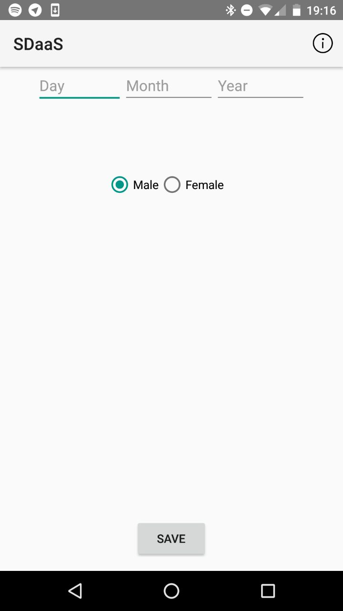
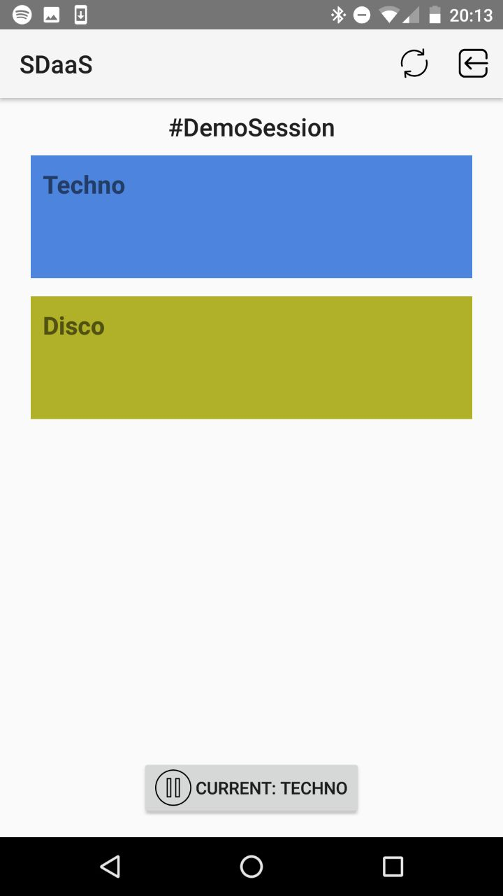

Android App
============
The app allows users to join your organized silent disco session. The app can be installed on any Android smartphone running ``Android 5.0 Lollipop`` (API 21) or higher and can be downloaded from `app.sdaas.nl <app.sdaas.nl>`_. The following section will explain how to use the app and briefly go over inner workings of it.

Using the app
-------------

When initially launching the app, it will prompt a settings screen asking for basic information. This will only be seen when starting the app for the first time. Your information will be stored anonymously on our server. All information stored can be removed from our server at any time with options in our app that will be covered.

When the required information is filled in and the client has been set up, the user is able to join a session using the chosen *join code*. This join code is unique to one session. On top, two buttons can be found. One of which allows the user to edit or fully delete their previously filled in information. The other simply shows information about the app.

After joining a session, an overview of the session's channel(s) is shown and enables users to select a channel to listen to by simply clicking on it. The color and names of these channels are editable in the control panel. The bottom *pause* button can be clicked if one wants to leave the current channel for a moment. Changing channels can also be fully controlled using the (middle) button on your headphones, just like one would do in a silent disco. On top, two buttons can be found to either refresh the session (that is, reloading all session and channel information) or to leave the session.
