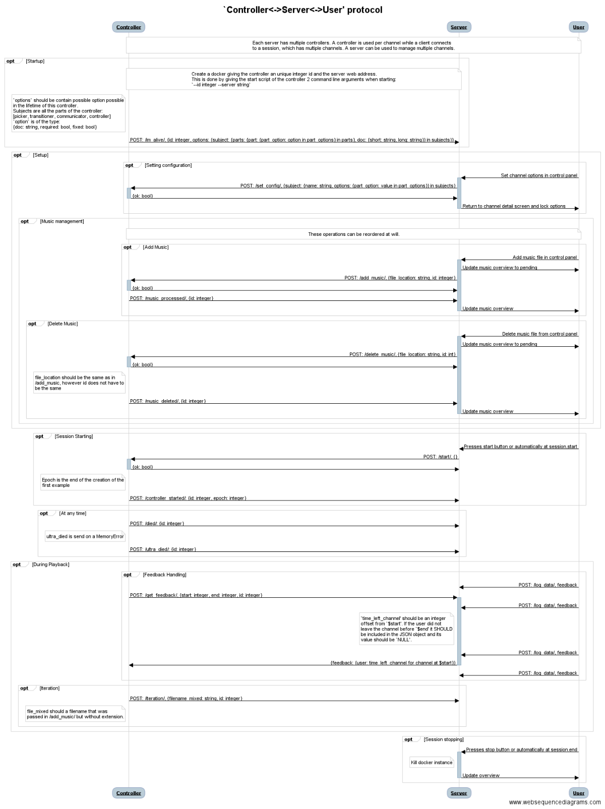

Infrastructure
==============

The sdaas infrastructure is based around three modular applications:

* Android client, which streams music from a streaming server and logs usage
  data to a webserver.
* Controller, which generates and mixes music, based on music feature analysis
  and user feedback.
* Centralized server, which connects everything together.

For this to work there are custom JSON protocols for the applications to
communicate through.

Controller to Server protocol
-----------------------------

The controller to server protocol is visualized in the following image:

Server to Client protocol
-------------------------

The server to client protocol is much simpler than the controller to server
protocol. When a client joins it sends a *join_session* request to the server.
The server will respond with an array of all the channels in the session.

Data is logged using the *log_data* request. When a client does not have a
client id yet, it sends a *new_client* request.

