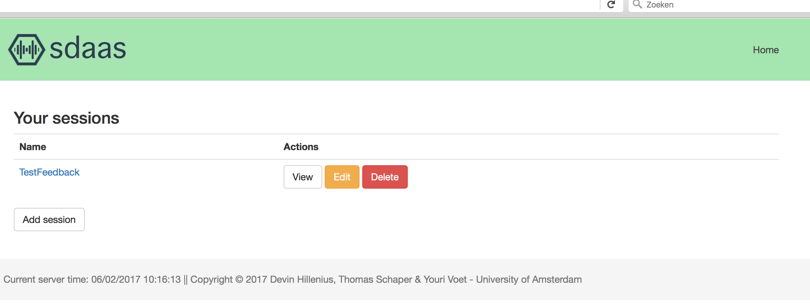
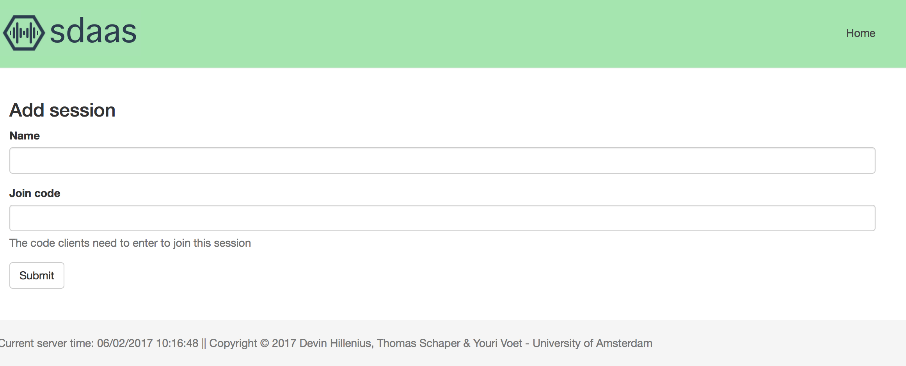
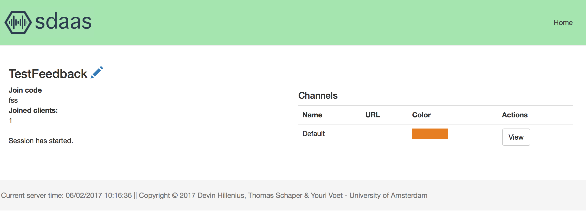
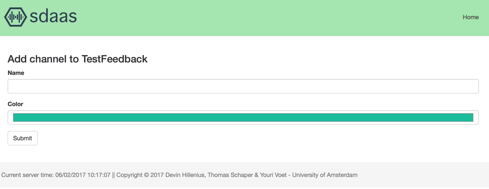
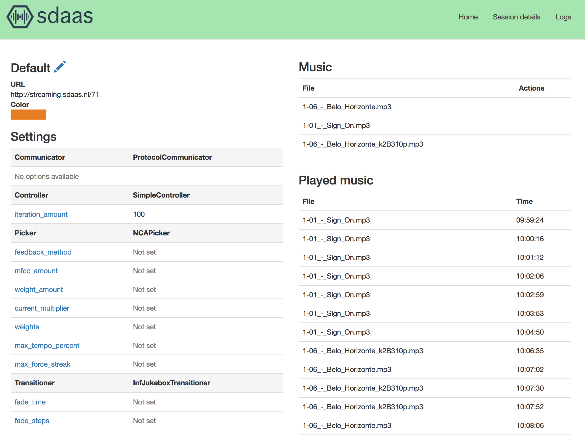

Usage
=====

The intuitive control panel of sdaas makes it very easy to use. When you open
the control panel the first page you see is the home page, which list all the
sessions available:

Setting up sessions
-------------------

When you add a new session you can set the name and the join code (which
Android clients need to type in when joining a session:

After creating a new session you get to the session detail page, where
detailed information about the session is available. This is also the place
where you can add and modify channels.

Setting up channels
-------------------

When adding a new channel, some options are available. You can set its name
and set the colour (this is the colour that is displayed in the Android app).

After adding a new channel you get to the channel detail page. Here you can
upload music and change all the options for the channel controller.
Documentation for these options is available by hovering over the option name.
See the Controller documentation for more information.

Committing settings
~~~~~~~~~~~~~~~~~~~

After setting all options, the settings need to be committed to the underlying
channel controller for them to become active. After settings are committed, it
is not possible to modify them. You can only start uploading music or starting
a channel once the settings are committed.
